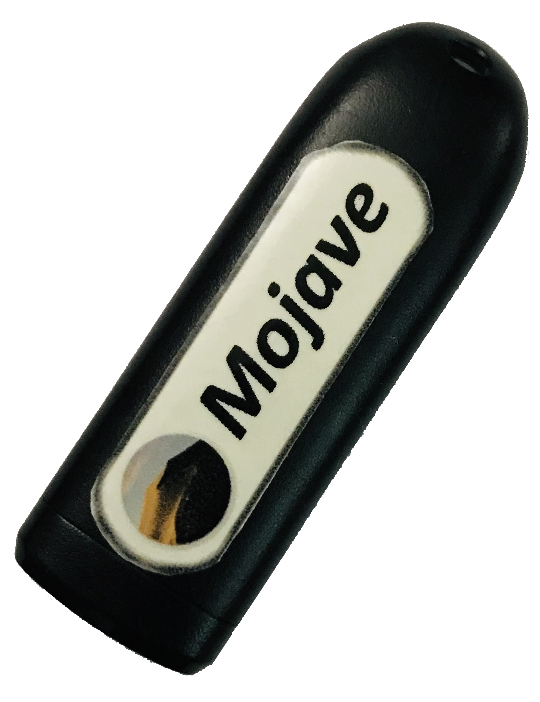

# Lenovo Legion Y730/Y740 running macOS Mojave
<p align="justify" >
If you are a windows user and require macOS to learn XCode, then you can transform your windows machine into the Hackintosh machine. Remember, this tutorial is for educational purpose. I will be not responsible for any damage done to your device while installing macOS. Do at your own risk. This tutorial is only for Lenovo legion Y730/Y740. Back up your important files before starting. All files, that you require for macOS installation, are available on my GitHub page. This guide is in <b>chronological order</b>. So, do not miss any steps. Now let's begin.
</p>
<p align="center"></p>


## Make Bootable USB with macOS Mojave, on a Windows 10 machine:
```
  ✰✰✰✰✰✰✰✰✰✰✰✰✰✰✰ You can make a bootable USB from an original Mac machine, or ✰✰✰✰✰✰✰✰✰✰✰✰✰✰✰✰
  ✰✰✰✰✰✰✰✰✰ from a macOS installed into VirtualBox (especially the Windows OS users) ✰✰✰✰✰✰✰✰✰✰
  ```
</img>
- Here I will explain the process of making a bootable USB drive. So be patience:
  - Size of the USB drive can be 8GB or more.
  - Install any macOS operating system(Sierra or later) into a VirtualBox.
  - You can download the macOS_Mojave.dmg file from [geekrar.com](https://www.geekrar.com/download-macos-mojave-dmg-file-direct-links/), then open it through VirtualBox and copy "macOS Mojave Installer" into the "Applications" section of macOS.
  - Use USB 2.0 pen drive, to avoid error like: 🚫  sign with [dark background](https://github.com/md-siam/Hackintosh-Legion-Y730_Y740/blob/master/images/USB_Disconnected.jpg)
  - Turn on "Terminal" and copy & paste the command below:
  - ```sudo /Applications/Install\ macOS\ Mojave.app/Contents/Resources/createinstallmedia --volume /Volumes/MyVolume```
  - "MyVolume" - it is the name of your USB pen drive.
  - After making a USB bootable device, download "Clover Configurator" inside the VirtualBox. Mount the EFI partition, of the USB drive, using clover configurator, and replace the EFI folder with my EFI folder (unzip EFI.7z before placing it inside EFI partition).
  - Done with bootable USB device.


## BIOS Settings:
```
  ✰✰✰✰✰✰✰✰✰ First of all, upgrade your Lenovo Legion Y730 BIOS to "8XCN34WW (V2.03)" ✰✰✰✰✰✰✰✰✰✰
  ✰✰✰✰✰✰✰✰✰✰✰✰✰✰✰✰✰ Because this EFI file is only tested in that BIOS version ✰✰✰✰✰✰✰✰✰✰✰✰✰✰✰✰✰
  ✰✰✰✰✰✰✰✰✰✰✰✰✰✰ WARNING! BIOS version downgrading is NOT possible in any laptop ✰✰✰✰✰✰✰✰✰✰✰✰✰✰
  ✰✰✰✰✰✰✰✰✰✰✰✰✰✰✰✰ So, if you upgrad to a newer version then you CANNOT downgrade ✰✰✰✰✰✰✰✰✰✰✰✰✰
  ```
  
- Press F2 to get into the BIOS. Match your BIOS setting with the pictures given below:
  - Information: [Photo](https://github.com/md-siam/Hackintosh-Legion-Y730_Y740/blob/master/images/BIOS_0.jpg)
  - Configuration: [Photo](https://github.com/md-siam/Hackintosh-Legion-Y730_Y740/blob/master/images/BIOS_1.jpg)
  - Security: [Photo](https://github.com/md-siam/Hackintosh-Legion-Y730_Y740/blob/master/images/BIOS_2.jpg)
  - Boot: [Photo](https://github.com/md-siam/Hackintosh-Legion-Y730_Y740/blob/master/images/BIOS_3.jpg)
  - Exit: Save the changes and exit from BIOS [Photo](https://github.com/md-siam/Hackintosh-Legion-Y730_Y740/blob/master/images/BIOS_4.jpg)


## macOS Mojave Installation: 
- If everything is done properly, then installation of macOS will be without any ERRORS
  - Insert the bootable USB driven.
  - Press F12 to get into boot option. In the list, you will see your USB boot drive, which is loaded with macOS. Choose that.
  - It will start Clover boot loader.
  - You will see an option like [this](https://github.com/md-siam/Hackintosh-Legion-Y730_Y740/blob/master/images/clover_1.jpg).
  - Choose Boot macOS. This will execute the installation process. 
  - You will see [macOS Utilities](https://github.com/md-siam/Hackintosh-Legion-Y730_Y740/blob/master/images/macOS_1.jpg).
  - Choose Disk Utilities and format the drive, where you want to install macOS, to Extended Journal. GTP partition mapping. Then press Install macOS.
  - If you get an error like [this](https://github.com/md-siam/Hackintosh-Legion-Y730_Y740/blob/master/images/macOS_2.jpg), then change the time of your laptop using terminal.
  - First disconnect your ethernet cable.
  - If you are not familiar with Terminal, then follow the procedure in [photo 1](https://github.com/md-siam/Hackintosh-Legion-Y730_Y740/blob/master/images/macOS_3.jpg) & [photo 2](https://github.com/md-siam/Hackintosh-Legion-Y730_Y740/blob/master/images/macOS_4.jpg) to set the year to 2016.
  - After changing the year, press Install macOS. It will start the installation of macOS to your Y730.
  - Congratulation! 👍
  

## After macOS Installation: 
  - Choose the partition where you install your macOS Mojave, suppose "macOS SSD".
  - Setup your keyboard.
  - Copy "Clover Configarator" app to your "Applications" section.
  - Mount the EFI partition of both USB and "macOS SSD".
  - Copy the EFI folder from USB to EFI partition of "macOS SSD".
  - Now enjoy your hackingtosh.

## For Using Wi-Fi:

<p align="justify" >
So far everything is working smoothly, except the <b>Wi-Fi card</b> inside the laptop. With my laptop, there is Intel® Wireless-AC 9560 dual-band Wi-Fi card, and there is no macOS driver for this Intel 9560 Wifi card. But the <b>Bluetooth</b> inside the Intel card works perfectly. So, to enable the Wi-Fi connection, I bought a Tp-Link Archer T4U Wi-Fi adapter. A picture of my WiFi card is given on your right. Driver for this Wi-Fi adapter can be downloaded from <a href="https://www.tp-link.com/uk/support/download/archer-t4u/#Driver" target="_blank">here</a>.
</p>


## Alternative of Archer T4U:

<p align="justify" >
If you want to keep everything inside your laptop and do not want a big ugly USB drive always attached to the back of the laptop, then the <b>Broadcom BCM94352Z</b> Wi-Fi card is the alternative of the Tp-Link Archer T4U. But it is expensive if you want to buy in brand new condition. This card is manufactured by <b>Lenovo</b> only.
</p>
<p align="justify" >
Check for Lenovo branding, on the card, before you buy any Wi-Fi card. There DW cards from DELL which will not work, & can damage your macOS installation files. So, only Lenovo branding <b>Broadcom BCM94352Z</b> Wi-Fi card will work in Legion Y730. The Wi-Fi card on your left will work with Apple macOS.
</p>
<p align="justify" >
After installing the Broadcom BCM94352Z Wi-Fi card you will need some additional <b>kext</b> files from a different source. I do not have those kext files into the EFI folder. Follow the guide given here to enable your <b>Broadcom Wi-Fi card</b>. Guide: <a href="https://www.tonymacx86.com/threads/broadcom-wifi-bluetooth-guide.242423/" target="_blank">Broadcom WiFi/Bluetooth</a>.
</p>


## Intel® Virtualization Technology (Intel® VT)
Many applications use Intel Virtualization Technology to work properly, examples like:
- Android Emulator
- iPhone Simulator
- XAMPP
- Virtual Machine
- VMWare
- etc..

So, after successful macOS installation, enabled "Intel Virtual Technology" from BIOS, and those apps will work properly.


## Special Thanks To:
 - [tonymacx86](https://www.tonymacx86.com) for Clover
 - [geekrar](https://www.geekrar.com) for full macOS Mojave DMG file [sharing](https://www.geekrar.com/download-macos-mojave-dmg-file-direct-links/)
 - [ᔕᗩᕼᗩᗷᗩT GEᗰᗷᒪᑌᑎG](https://twitter.com/Goeprulz) for providing his [EFI](https://www.dropbox.com/s/hfy1jwdja3wbj76/EFI_LEGION_Y740_10.14.6_V3.zip?dl=0) folder
 - [ComputerTipsLaiju](https://www.youtube.com/watch?v=57aA8e9YQSg&t=66s) for macOS installation guide
