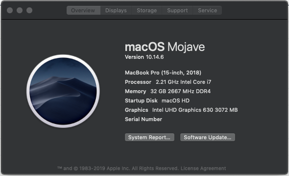
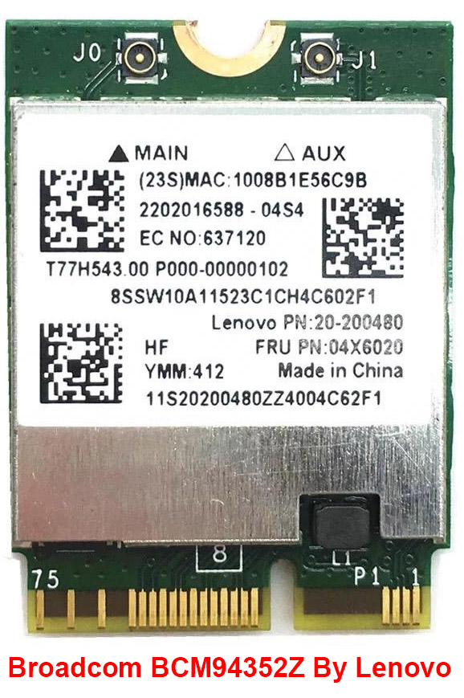

# Lenovo Legion Y730 running macOS Mojave

If you are a windows user and require macOS to learn XCode, then you can transform your windows machine into hackintosh machine. Remember, this tutorial is for educational purpose. I will be not responsible for any damage done to your device while installing macOS. Do at your own risk.
This tutorial is only for Lenovo legion Y730/Y740. Back up your important files before starting. All files, that you require for macOS installation, are available in my GitHub page. So, let’s begin

## BIOS Settings:

- Press F2 to get into the BIOS. Match your BIOS setting with the pictures gives below:
  - Configuration: [Photo](https://github.com/md-siam/Hackintosh-Legion-Y730_Y740/blob/master/images/BIOS_1.jpg)
  - Device Configuration: [Photo](https://github.com/md-siam/Hackintosh-Legion-Y730_Y740/blob/master/images/BIOS_2.jpg)
  - Boot: No change
  - Exit: Save the changes and exit from BIOS

## Bootable USB with macOS Mojave:
- Here I will explain the process of making a bootable USB drive. Be patience here:
  - Size of the USB drive can be 8GB or more.
  - Use USB 2.0 drive, to avoid errors like: 🚫  sign with dark [background](https://github.com/md-siam/Hackintosh-Legion-Y730_Y740/blob/master/images/USB_Disconnected.jpg)
  - Use Unibeast for making a bootable USB, and for that you can first install macOS into a VirtualBox (assuming u don’t have access to a mac).
  - You can download the macOS macOS.dmg file from [geekrar.com](https://www.geekrar.com/download-macos-mojave-dmg-file-direct-links/), then open it through VirtualBox.
  - After making a USB bootable device, download "Clover Configurator" inside VirtualBox. Mount the EFI partition using clover configurator, and replace the EFI folder with my EFI folder (unzip EFI.7z before placing it inside EFI partition).
  - Done with bootable USB device.

## macOS Mojave Installation: 
- If everything is done properly, then installation of macOS will be without any ERRORS
  - Insert the bootable USB driven.
  - Press F12 to get into boot option. In the list, you will see your USB boot drive, which is loaded with macOS. Choose that.
  - It will start Clover boot loader.
  - You will see an option like [this](https://github.com/md-siam/Hackintosh-Legion-Y730_Y740/blob/master/images/clover_1.jpg).
  - Choose Boot macOS. This will execute the installation process. 
  - You will see [macOS Utilities](https://github.com/md-siam/Hackintosh-Legion-Y730_Y740/blob/master/images/macOS_1.jpg).
  - Choose Disk Utilities and format the drive, where you want to install macOS, to Extended Journal. GTP partition mapping. Then press Install macOS.
  - If you get an error like [this](https://github.com/md-siam/Hackintosh-Legion-Y730_Y740/blob/master/images/macOS_2.jpg), then change the time of your laptop using terminal.
  - First disconnect your ethernet cable.
  - If you are not familiar with Terminal, then follow the procedure in [photo 1](https://github.com/md-siam/Hackintosh-Legion-Y730_Y740/blob/master/images/macOS_3.jpg) & [photo 2](https://github.com/md-siam/Hackintosh-Legion-Y730_Y740/blob/master/images/macOS_4.jpg) to set the year to 2016.
  - After changing the year, press Install macOS. It will start the installation of macOS to your Y730.
  - Congratulation! 👍

## After macOS Installation: 
  - Choose the partition where you install your macOS Mojave, suppose "macOS SSD".
  - Setup your keyboard.
  - Copy "Clover Configarator" app to your application forlder.
  - Mount the EFI partition of both USB and "macOS SSD".
  - Copy the EFI folder from USB to EFI partition of "macOS SSD".
  - Now enjoy your hackingtosh.

## Things that do not works:

So far everything is working smoothly, except the Wi-Fi card inside the laptop. With my laptop there is Intel® Wireless-AC 9560 dual band Wi-Fi card, and there is no macOS driver for this Intel 9560 Wifi card. But the <b>Bluetooth</b> inside the Intel card works perfectly. So, in order to enable the Wi-Fi connection, I bought a Tp-Link Archer T4U Wi-Fi adapter. A picture of my WiFi card is given on your right. Driver for this Wi-Fi adapter can be downloaded from <a href="https://www.tp-link.com/uk/support/download/archer-t4u/#Driver" target="_blank">here</a>.

## Alternative of Archer T4U:

If you want to keep inverything inside your laptop, then Broadcom BCM94352Z Wi-Fi card is the alternative of Tp-Link Archer T4U. But it is expensive if you want to buy it brand new. This card is menufacture my <b>Lenovo</b>. Check for Lenovo branding ,in the card, before you buy any Wi-Fi card. Any Wi-Fi card will not work with Legion Y730. So, the Wi-Fi card on your left will work with Apple macOS.

  After installing the Broadcom BCM94352Z Wi-Fi card you will need some additional kext files. 

## Special Thanks To:
1. [tonymacx86](https://www.tonymacx86.com) for Clover
2. [geekrar](https://www.geekrar.com) for full macOS Mojave DMG file [sharing](https://www.geekrar.com/download-macos-mojave-dmg-file-direct-links/)
3. [ᔕᗩᕼᗩᗷᗩT GEᗰᗷᒪᑌᑎG](https://twitter.com/Goeprulz) for providing his [EFI](https://www.dropbox.com/s/hfy1jwdja3wbj76/EFI_LEGION_Y740_10.14.6_V3.zip?dl=0) folder
4. [ComputerTipsLaiju](https://www.youtube.com/watch?v=57aA8e9YQSg&t=66s) for macOS installation guide

## Intel® Virtualization Technology (Intel® VT)
Many applications use Intel Virtualization Technology to work properly, example like:
- XAMPP
- Android Studio
- Virtual Machine/VMWare
- etc..

So, after successful macOS installation, enabled "Intel Virtual Technology" from BIOS, and those apps will work perfectly.
